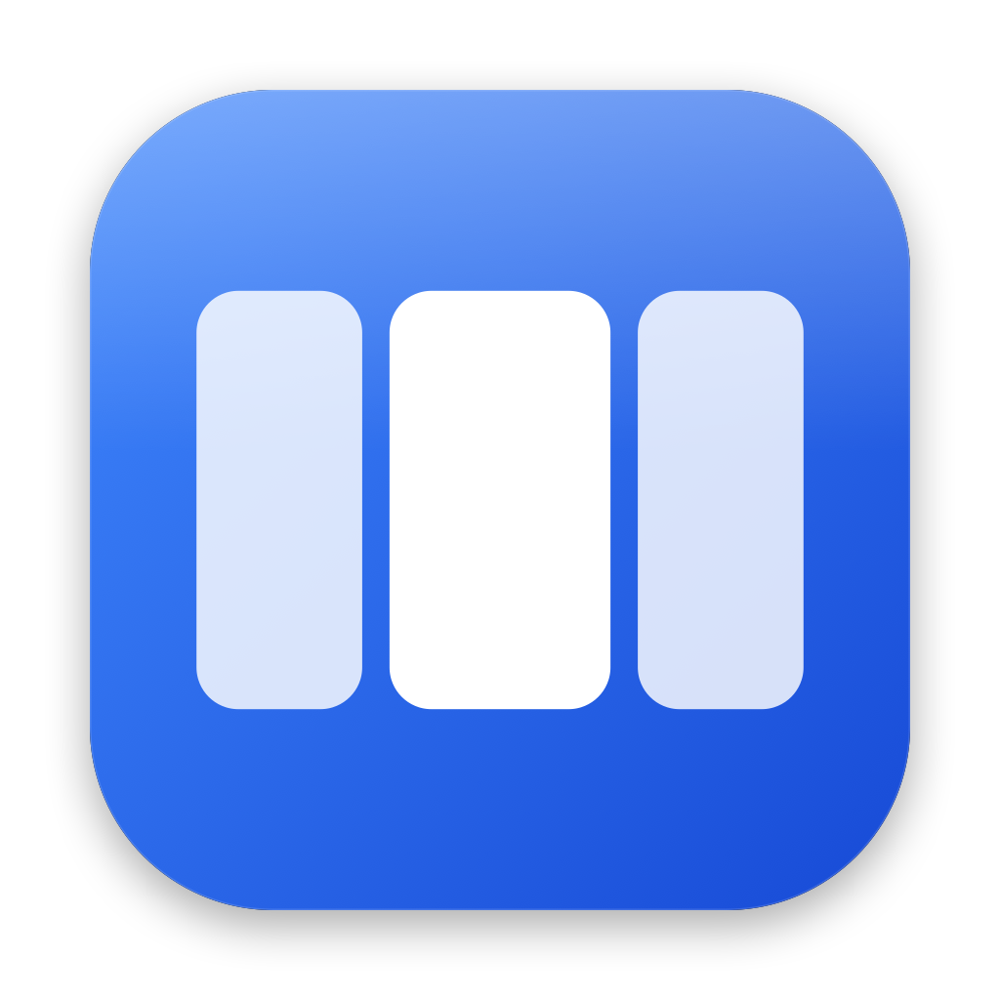
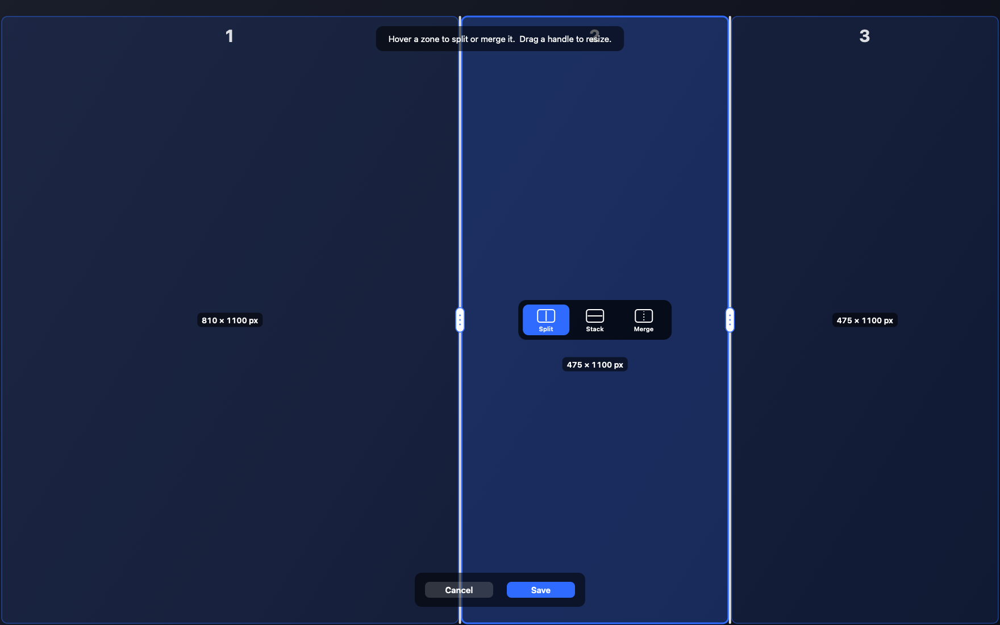

<div align="center">



# Lineup

**A native macOS menu-bar suite for window layouts and keyboard shortcuts.**

[Download](https://lineup.caiano.com) · [Build from source](BUILDING.md) ·
[Contribute](CONTRIBUTING.md)

</div>



Lineup combines four tools. Enable only the tools you need:

- **Zones:** Draw a window layout on each display. Move windows with Shift-drag or a shortcut.
- **Tiles:** Place windows in those Zones automatically, with four workspaces, stacks, spatial
  keyboard control, and optional 8 pt spacing.
- **Cycler:** Cycle through apps and windows with shortcuts, including app groups and
  reverse cycling.
- **Hyperkey:** Turn Caps Lock or another key into Control + Option + Command. You can include Shift.

Lineup is built with Swift, AppKit, and SwiftUI. It requires macOS 13 or later.
Zones is on by default. Tiles, Cycler, and Hyperkey start off, so an update does not arrange
windows or claim new keys without an explicit choice.

Before Tiles arranges windows for the first time, Lineup asks you to confirm. Editing Tiles
shortcuts before enabling it does not skip this confirmation.
An older enabled setup that has not recorded this choice waits safely in Tiles Settings after an
update. It does not move windows during launch.
Tiles workspaces are virtual contexts, not macOS Spaces. Windows in inactive workspaces are
minimized through Accessibility, so they remain visible in normal macOS window-management views.

## Recommended keyboard model

The fresh preset keeps Caps+1…4 and every existing Cycler letter unchanged. With Hyperkey Include
Shift off, Caps+U/I/O/P switches Tiles Workspaces 1…4, and physical Shift+Caps+U/I/O/P moves the
focused window to that workspace. Caps+W/A/X/D focuses the nearest tile up/left/down/right;
physical Shift+Caps+W/A/X/D moves the focused window in that direction. Caps+Tab cycles a tile
stack; physical Shift+Caps+Tab cycles it in reverse. Caps+Return changes the split, Caps+Space
toggles tiled/freeform, and Caps+arrows keeps the Zones quick actions.

When Hyperkey Include Shift is on, the same U/I/O/P workspace and W/A/X/D focus shortcuts use the
full Hyper mask. Their physical Shift variants are not generated because they are indistinguishable
from the base shortcuts. Y/G/B/H forms a second up/left/down/right movement diamond in that mode.
An untouched preset follows the Hyperkey mode; customized shortcuts and Cycler bindings are never
changed silently.

If an existing Cycler app group conflicts with a recommended Tiles key, Lineup keeps the Cycler
binding unchanged and marks the Tiles shortcut as blocked. Choose a different Tiles shortcut to
resolve the conflict. Lineup never changes Cycler keys. While Tiles is active, Cycler uses windows
in the current Tiles context first, then brings forward one safe inactive-workspace window when
needed. During a layout pause, current-context and freeform Cycler actions remain usable. Only an
inactive-workspace switch shows blocked feedback. Tiles resumes automatically when the Zones layout
is available.

## Install

1. Download the current version from [lineup.caiano.com](https://lineup.caiano.com).
2. Move Lineup to Applications and open it.
3. Allow Accessibility access when macOS asks. Lineup needs it to inspect and move windows.
4. If you enable Hyperkey, allow Input Monitoring when macOS asks. The other tools do not request
   this permission.

## Build from source

```sh
git clone https://github.com/hcaiano/lineup.git
cd lineup
swift build
swift run lineup-tests
```

Building needs the macOS 26 SDK. Command Line Tools 26 are enough; full Xcode is optional. See
[BUILDING.md](BUILDING.md) to assemble the app, keep a stable local Accessibility grant, and
understand the project layout.

## Contribute

Read [CONTRIBUTING.md](CONTRIBUTING.md) before you report a bug or open a pull request. New features
and behavior changes should start in [Discussions](https://github.com/hcaiano/lineup/discussions).

## License

Lineup is available under the [Apache License 2.0](LICENSE). Releases before 2.0.0 remain under
their [MIT License](LICENSE-1.x).
