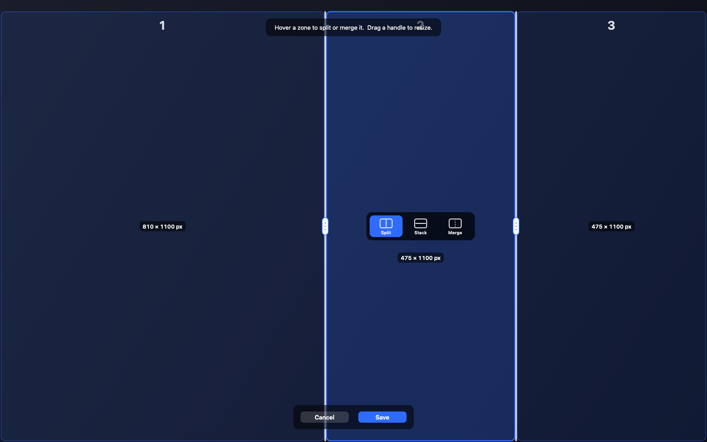

<div align="center">


# Lineup

**A native macOS menu-bar suite for window layouts, keyboard shortcuts and world clocks.**

[Download](https://lineup.caiano.com) · [Build from source](BUILDING.md) ·
[Contribute](CONTRIBUTING.md)

</div>



Lineup combines eight tools. Enable only the tools you need:

- **Zones:** Draw a window layout on each display. Move windows with Shift-drag or a shortcut.
  Zone shortcuts are numbered across ALL your displays: each display's Settings group shows its
  global zone range, and `zone:N` moves the focused window to that global zone on its owning
  display — even across displays. Numbers belong to saved displays, so unplugging one keeps its
  range reserved (those shortcuts wait safely instead of moving a different display's windows).
  Note that adding or removing zones on an earlier display shifts the numbering of every later
  display, since each display's range follows the one before it.
- **Cycler:** Cycle through apps and windows with shortcuts, including app groups and
  reverse cycling.
- **Hyperkey:** Turn Caps Lock or another key into Control + Option + Shift + Command.
- **Keyboard Remap:** Remap or swap physical keys on one keyboard, including the built-in
  keyboard, while other keyboards keep their mappings.
- **World Clock:** Compare cities with your local time, scroll through nearby hours, and pin a
  place's live time to the menu bar. City search and sunrise/sunset estimates work offline.
- **Keep Awake:** Prevent idle sleep for 15 minutes, 30 minutes, 1 hour, or 2 hours.
  Choose separately whether the display should stay on.
- **Text Capture:** Select a region on any display and copy its text, recognized locally in
  Portuguese and English.
- **Menu Bar:** Hide the icons you place left of an arrow, and show them with one click.
  Requires macOS 27 and is off by default.
- **Scroll:** Reverse the mouse and the trackpad separately, for example a traditional mouse
  wheel with natural trackpad scrolling.

Lineup is built with Swift, AppKit, and SwiftUI. It requires macOS 13 or later.

## Remembering app placement

Zones remembers the last successful placement for each app, including zone shortcuts, directional
shortcuts and Shift-drag edge or corner placements. Quit and relaunch that app while Zones is running
to put its first regular window back in the saved destination. Splash screens and sheets are skipped.
Additional windows stay where the app opens them. Moving or resizing a window yourself, or using
Restore, leaves the remembered destination unchanged.

This happens once per app launch. Enabling Zones or restarting Lineup does not move windows of apps
that are already running. Turning Zones off stops pending restorations. Missing Accessibility access
or a failed move does not cause repeated placement attempts.

Destinations use the saved display identity, not shortcut numbers. If that display is disconnected,
the window stays where macOS opens it and the association is kept for a later launch. A changed
layout is also skipped. Saving layout edits clears remembered placements for that display; place an
app again to teach its new destination. Editing another display or changing display order does not
affect it. Learning also waits while an old layout import is pending; reconnect that display first.
Associations live in the shared `~/.config/lineup/config.json` file.

## World Clock

Enable World Clock in Settings to add its clock icon to the menu bar. It starts disabled and
does not require Accessibility, Input Monitoring or location access. Its icon is independent of
the main Lineup icon's visibility preference.

- Click **+** to search cities or IANA time zones, such as `Europe/Lisbon`. Search accepts alternate
  names and ignores accents. Cities include their region and country to distinguish namesakes.
- Clocks run from earlier to later local time, with **Local** in its chronological position.
  Local follows the Mac's time zone; ordering follows the selected instant, including daylight saving.
- Use **Edit** to rename or remove places, or reorder cities that share the same time.
- Click a **pin** to replace the clock icon with one place's name and live time. Pinning another
  place replaces the previous pin; unpinning or removing it restores the icon. Local can be pinned.
- Drag or scroll the time ruler, or use its arrow keys, to move in 15-minute steps across ±24
  hours. The local time field accepts an exact time on the selected day. **Now**, or closing and
  reopening the panel, restores live time. A pinned menu-bar time always remains live.
- Hours follow the Mac's 12/24-hour preference. Day labels and differences use the selected
  instant, including daylight-saving transitions and fractional-hour zones.
- Each city shows its next sunrise or sunset at the selected instant. `+1d` means the next city
  date. Solar times are approximate; polar day/night appears when there is no nearby event.
  Local and bare time zones have no solar data because they do not identify coordinates.

The bundled [GeoNames](https://www.geonames.org/) catalog covers cities with more than 15,000
inhabitants and capitals. Smaller places may be absent; add a nearby city or its time zone.
The catalog is distributed under [CC BY 4.0](https://creativecommons.org/licenses/by/4.0/).
Settings includes attribution links. No search or solar request leaves the Mac.

## Install

1. Download the current version from [lineup.caiano.com](https://lineup.caiano.com).
2. Move Lineup to Applications and open it.
3. Allow Accessibility access when macOS asks. Lineup needs it to inspect and move windows.
4. If you enable Hyperkey, allow Input Monitoring when macOS asks. The other tools do not request
   this permission.

## Remap keyboard keys

Open Settings → Keyboard Remap, select a keyboard and add a source and destination key.
Choose **Swap keys** to exchange two keys. The built-in keyboard preset exchanges the ISO
section key, often labeled §/±, with the grave accent and tilde key. The selected keyboard layout
controls the symbols shown in Settings. Rules use physical keys, including their Shift behavior.

The tool starts off. Enable it after choosing your rules. Rules remain saved when a keyboard is
disconnected and apply again on reconnection. A keyboard without rules keeps its existing map.
Hyperkey can run alongside Keyboard Remap; Caps Lock and F18 cannot have contradictory rules.

If Settings reports a conflict, change the rule or stop the app or login script that owns the
conflicting mapping, then choose **Retry**. Lineup preserves external mappings and leaves an
unreadable table untouched. Disabling a tool or quitting Lineup removes only the pairs it added.
Keyboard Remap needs no extra permissions.

## Keep Awake

Enable Keep Awake in Settings, then choose a duration from its menu-bar submenu or start a
session in Settings. The menu bar shows "Awake" while a session is active. Open its submenu
to see the remaining time or stop early.

"Keep display on" is off by default. Turning it on or off during a session keeps the original
deadline. Choosing another duration starts a new session. Expiration, stopping, disabling the
tool, sleeping the Mac, or quitting Lineup releases its power requests. Waking or restarting
Lineup never resumes a session. Only the duration and display preference are saved.

Keep Awake needs no extra permissions and does not change permanent macOS power settings.
You can still lock the screen or explicitly sleep the Mac. Closed-lid operation is not supported.

## Copy text from the screen

1. Open Settings → Text Capture and enable the tool. It starts off, with no shortcut assigned.
2. Choose **Capture Text…** in the menu bar or Settings. You can also record a global shortcut
   in its settings. Conflicts with other Lineup tools or apps are reported there.
3. On the first capture, allow Screen Recording in macOS. Enabling the tool alone never asks for
   this permission. If access was denied or revoked, use **Open Screen Recording Settings…** in
   Text Capture or General → Permissions. Quit and reopen Lineup if macOS asks, then try again.
4. Drag around text on one display and release to copy it. Press Escape to cancel selection.
   A drag crossing a display edge is limited to the display where it started.
5. After **Text copied**, paste with Command-V in the destination app. Nothing is pasted automatically.

Empty captures, failed recognition, and cancellation leave the clipboard unchanged. Select a
larger region if small text is missed. The engine reads rows from top to bottom and fragments from
left to right; complex columns and tables may need separate captures. Portuguese and English
language support must both be available in the local macOS recognition engine. If either is
unavailable, Text Capture explains this without replacing the clipboard.

Invoking capture again during selection or recognition does not start another job. Use **Cancel
Text Capture** in the menu to stop pending work. Display changes, disabling the tool, and quitting
Lineup also cancel it. Captures stay in memory and are released after use; Lineup does not keep a
capture history, log the recognized text, or send it to a service. The copied text remains on the
system clipboard until another app or copy action replaces it.

## Organize the menu bar

On macOS 27, enable **Menu Bar** in Settings. It adds an arrow to the menu bar. Accessibility is
needed to see which side of the arrow each icon is on. Screen Recording and Full Disk Access are
not required.

Hold Command (⌘) and drag icons in the menu bar: icons to the left of the arrow hide when it
collapses, and icons to its right stay visible. Click the arrow to show the hidden icons in place;
they hide again after 10 seconds, but not while the pointer is on the menu bar or one of their
menus is open. The group starts collapsed. Lineup never moves your pointer or drags icons for you.
**Settings › Menu Bar** shows both groups.
Press Return in that pane to show or hide the icons without moving your pointer.

macOS 27 hides whole apps: an app with an icon on each side of the arrow stays visible. System
icons such as the clock and Control Center always stay visible. Disabling Menu Bar, quitting and
crashes restore the visibility flags changed by Lineup. Apps already hidden in macOS settings
stay hidden. Quit other menu bar managers before using Lineup to avoid competing changes.

The system clock, Notification Center and capture indicators stay usable while the group is
hidden. Synergy's tray can belong to either group. If Settings requests **Allow Menu Bar Access**,
choose the indicated settings file; Lineup changes only the visibility of your selected apps.

This tool uses a private macOS 27 interface. If macOS no longer offers it, the arrow stays but
nothing hides, and Settings says so. Menu Bar is unavailable on other macOS versions; the other
tools still support macOS 13+.

## Reverse scrolling

macOS has one scroll direction for every device. Enable **Scroll** in Settings to reverse the
mouse, the trackpad or both, on top of that direction. By default it reverses vertical mouse
scrolling and leaves the trackpad unchanged. **Vertical** and **Horizontal** choose the directions
reversed on each selected device. Changes apply to the next scroll, and the Lineup menu bar offers
quick switches for each device.

Settings shows what reversal means with your current macOS preference. Lineup never changes
**Natural scrolling** in System Settings; turning Scroll off or quitting Lineup restores the macOS
direction immediately. Scroll needs the Accessibility access Lineup already uses. Until it is
granted, scrolling keeps the macOS direction and the other tools keep working.

Each scroll is matched to the mouse or trackpad that produced it, so alternating devices, sleep,
and connecting a device need no action. Magic Mouse counts as a mouse. Speed and inertia are
preserved. Zoom, rotation, Mission Control and swipes between spaces are gestures, not scrolling,
and are unchanged. Apps that turn horizontal scrolling into page navigation, such as Safari, follow
the reversed horizontal direction; horizontal reversal is off by default. Scrolling posted by
other apps, such as remote-control or mouse utilities, and devices that are neither a mouse nor a
trackpad keep the macOS direction.

## Update tracks

Stable is the default and receives tested public releases. Nightly is a public opt-in in General
settings for newer builds that may be less reliable. Returning to Stable stops Nightly updates and
waits for a newer Stable release; Lineup does not install an older Stable version as a downgrade.

## Build from source

```sh
git clone https://github.com/hcaiano/lineup.git
cd lineup
swift build
swift run lineup-tests
```

Building needs the macOS 26 SDK or later. Command Line Tools 26 are enough; with the macOS 27 SDK,
the app needs full Xcode 27. See [BUILDING.md](BUILDING.md) to assemble the app, keep a stable
local Accessibility grant, and understand the project layout.

## Contribute

Read [CONTRIBUTING.md](CONTRIBUTING.md) before you report a bug or open a pull request. New features
and behavior changes should start in [Discussions](https://github.com/hcaiano/lineup/discussions).

## License

Lineup is available under the [Apache License 2.0](LICENSE). Releases before 2.0.0 remain under
their [MIT License](LICENSE-1.x).
